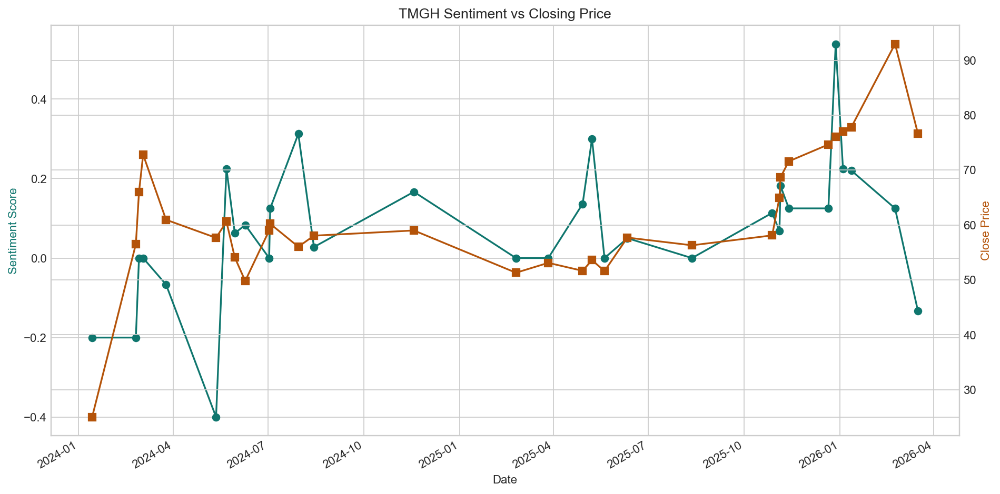
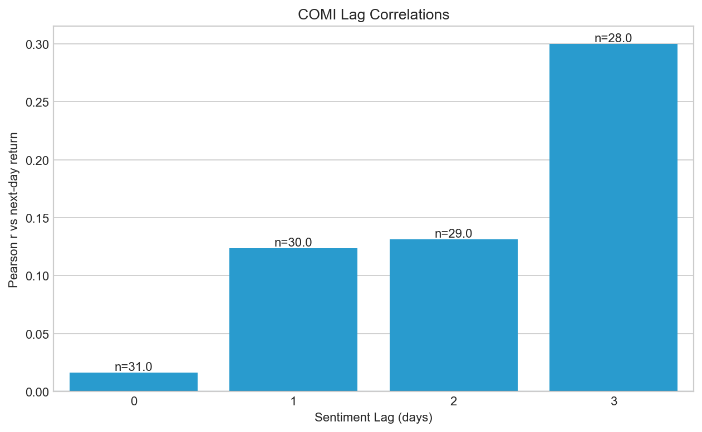
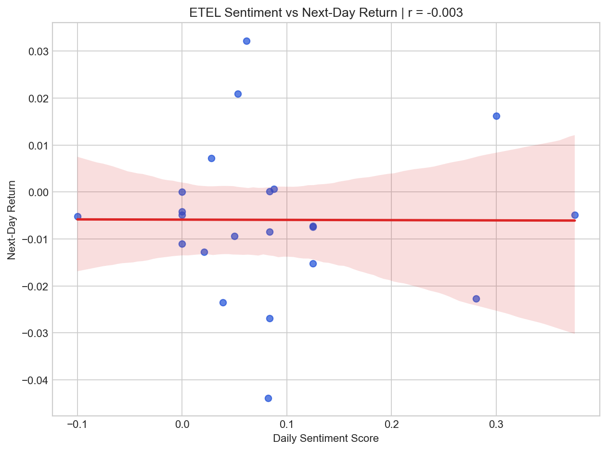

# EGX Stock Sentiment Analyzer

An end-to-end Python project that tests whether financial news sentiment for EGX-listed companies helps explain next-day stock movement.

This project combines web scraping, bilingual sentiment analysis, market data collection, lag correlation analysis, and chart generation into a portfolio-ready research pipeline.

## Research Question

Does the sentiment of Mubasher headlines on day `T` show any relationship with EGX stock returns on day `T+1`?

## Why This Project Matters

Most public sentiment-trading examples focus on US equities and English-only data. This project explores a harder and more interesting setting:

- Egyptian listed stocks on the EGX
- Mubasher financial headlines
- Mixed Arabic and English coverage
- Small-sample, real-world financial data where null results are still informative

## What The Pipeline Does

1. Scrapes stock-specific news headlines from Mubasher.
2. Detects headline language and scores sentiment.
3. Downloads historical EGX prices through `yfinance`.
4. Merges sentiment and price data by trading date.
5. Computes lag correlations between sentiment and next-day returns.
6. Generates charts for visual inspection.
7. Optionally prepares an LLM-ready findings context and report stage.

## Tech Stack

- Python
- Pandas
- BeautifulSoup
- yfinance
- TextBlob
- langdetect
- Matplotlib / Seaborn
- SciPy
- OpenAI API for optional findings generation

## Project Structure

```text
EGX/
|-- data/
|   |-- processed/
|   `-- raw/
|-- docs/
|   `-- assets/
|-- notebooks/
|   `-- analysis.ipynb
|-- outputs/
|   |-- charts/
|   `-- reports/
|-- src/
|   |-- config.py
|   |-- llm_analysis.py
|   |-- pipeline.py
|   |-- prices.py
|   |-- scraper.py
|   |-- sentiment.py
|   `-- visualize.py
|-- tests/
|-- requirements.txt
`-- run_pipeline.py
```

## Sample Visuals

### TMGH Sentiment vs Closing Price



### COMI Lag Correlations



### ETEL Sentiment vs Next-Day Return



## Preliminary Findings

These are exploratory results from the broader sample window `2024-01-01` to `2026-03-27`.

| Ticker | Company | Headlines | Merged Days | Strongest Observed Lag | Pearson r | Takeaway |
|---|---|---:|---:|---:|---:|---|
| TMGH | Talaat Moustafa Group | 32 | 31 | 1 day | -0.184 | Mildly negative relationship across the expanded window |
| COMI | Commercial International Bank | 32 | 31 | 3 days | 0.300 | Clearest delayed positive relationship in the current sample |
| ETEL | Telecom Egypt | 23 | 22 | 2 days | 0.301 | Noticeable lag signal, but still on a smaller sample |

## Interpretation

- `TMGH` no longer looks weakly positive in the broader sample. It trends mildly negative across all tested lags.
- `COMI` has the clearest delayed effect in the current run, with the strongest observed correlation at a 3-day lag.
- `ETEL` still produces a noticeable 2-day lag signal, but on a smaller sample than `COMI`.
- The project already surfaces an important lesson for financial ML: signal quality is uneven, and weak or null findings are valid outputs.

## Methodology

### Data Sources

- Mubasher stock news pages for ticker-level headlines
- Yahoo Finance via `yfinance` for EGX OHLCV price data

### Sentiment Scoring

- English headlines: `TextBlob`
- Arabic headlines: normalized lexicon-based scoring with finance-oriented phrase handling
- Language detection: `langdetect`

### Analysis

- Daily mean sentiment aggregation
- Next-day return calculation
- Pearson correlation across lags `0` to `3`
- Scatter and dual-axis charting for visual inspection

## How To Run

```bash
python -m venv .venv
.venv\Scripts\activate
pip install -r requirements.txt
python -m unittest discover -s tests -v
python run_pipeline.py --tickers TMGH COMI ETEL --start 2024-01-01 --end 2026-03-27 --pages 6 --delay 1.0
```

Optional LLM report stage:

```bash
set OPENAI_API_KEY=your_key_here
python run_pipeline.py --tickers TMGH COMI ETEL --start 2024-01-01 --end 2026-03-27 --pages 6 --delay 1.0 --with-llm-analysis
```

The notebook at `notebooks/analysis.ipynb` is written as a rendered narrative artifact for GitHub, with visible findings tables and embedded visuals rather than acting as a blank scratchpad.

## Testing

```bash
python -m unittest discover -s tests -v
```

Current automated coverage includes:

- scraper parsing behavior
- Arabic sentiment normalization and scoring
- sentiment aggregation
- lag-correlation calculations
- LLM report formatting helpers

## Limitations

- Sample sizes are still small for each ticker
- The Arabic sentiment model is a hardened fallback, not a full pretrained financial transformer
- Mubasher page structure may change over time
- Correlation does not imply predictive causation
- The optional LLM stage depends on API access and account quota

## Future Work

- Expand to more EGX tickers and longer time windows
- Add a stronger Arabic sentiment backend such as `camel-tools` or a Hugging Face model
- Compare sector-level behavior across banking, telecom, and real estate
- Improve notebook storytelling and publish a final research-style write-up

## Portfolio Value

This project demonstrates:

- practical data engineering
- scraper robustness against messy live HTML
- bilingual NLP handling
- market data alignment and lag analysis
- test-driven hardening of a research pipeline
- turning exploratory work into a shareable GitHub portfolio project
